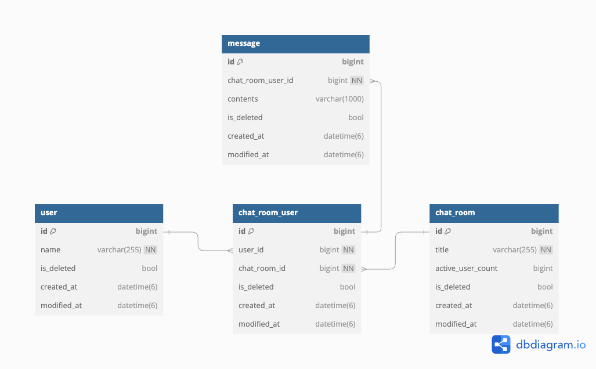
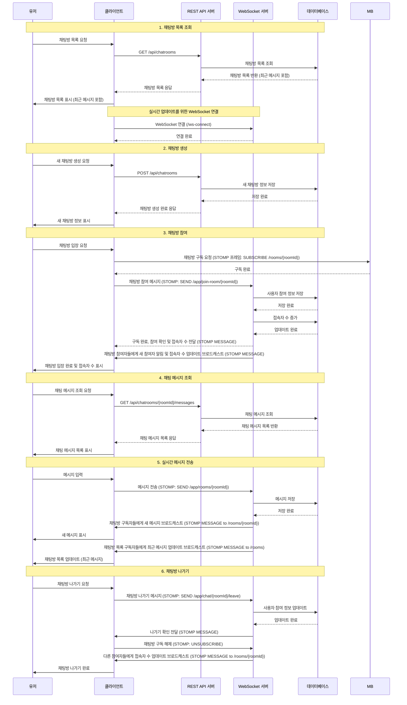

- [0. Chat-Server](#0-chat-server)
- [1. 실행 방법](#1-실행-방법)
    - [1-1. MySQL 데이터베이스 생성 및 테이블 초기화](#1-1-mysql-데이터베이스-생성-및-테이블-초기화)
    - [1-2. application.yml 파일 추가](#1-2-applicationyml-파일-추가)
    - [1-3. IntelliJ IDEA에서 프로젝트 실행](#1-3-intellij-idea에서-프로젝트-실행)
- [2. DB ERD](#2-db-erd)
- [3. Diagram](#3-diagram)

# 0. Chat-Server

| 실시간 채팅 서버 구현

# 1. 실행 방법

| MySQL, IntelliJ IDEA가 설치되어 있어야 합니다.

### 1-1. MySQL 데이터베이스 생성 및 테이블 초기화

1. MySQL에 접속
   ```
   mysql -u [유저네임] -p [비밀번호]
   ```

2. 데이터베이스 생성
   ```sql
   CREATE DATABASE chat_db;
   ```

3. MySQL 종료
   ```
   exit;
   ```

4. 스키마 파일로 테이블 초기화
   ```
   mysql -u [유저네임] -p [비밀번호] chat_db < ./src/main/resources/schema.sql
   ```

### 1-2. application.yml 파일 추가

`src/main/resources/application.yml` 파일을 생성하고 다음 내용을 추가해주세요.

```yaml
spring:
  datasource:
    driver-class-name: com.mysql.cj.jdbc.Driver
    url: jdbc:mysql://localhost:3306/chat_db?serverTimezone=Asia/Seoul&characterEncoding=UTF-8
    username: [ 유저네임 ]
    password: [ 비밀번호 ]
  jpa:
    database-platform: org.hibernate.dialect.MySQL8Dialect
    hibernate:
      ddl-auto: validate
    properties:
      hibernate:
        show_sql: true
        format_sql: true
        use_sql_comments: false
```

**주의**: `[유저네임]`과 `[비밀번호]` 부분을 실제 MySQL 사용자 이름과 비밀번호로 수정해주세요.

### 1-3. IntelliJ IDEA에서 프로젝트 실행

- IntelliJ IDEA를 실행하고 프로젝트를 엽니다.
- Gradle 도구 창을 엽니다 (보통 오른쪽 사이드바에 위치).
- 프로젝트 빌드
    - Gradle 도구 창에서 Tasks > build > build를 더블 클릭하여 프로젝트를 빌드합니다.
    - 또는 터미널에서 다음 명령을 실행합니다.
      ```
      ./gradlew build
      ```
- 애플리케이션 실행
    - src/main/java 디렉토리에서 메인 애플리케이션 클래스 (보통 ChatApplication.java)를 찾습니다.
    - 이 파일을 우클릭하고 "Run 'ChatApplication'"을 선택합니다.
    - 또는 Gradle 도구 창에서 Tasks > application > bootRun을 더블 클릭하여 실행합니다.

# 2. DB ERD



# 3. Diagram


